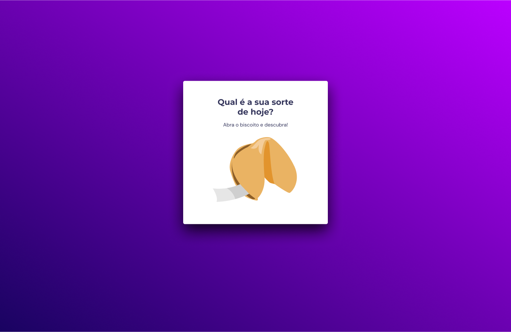

## :information_source: About

<div align="center">

Application built to practice some concepts of CSS and HTML and Javascript 🚀

</div>

<div align= "center">
  
  </div>

```text
Note: Add your project specific Read only files below.
```

## :information_source: How It Works

<div align="center">

The application has an array of strings containing various phrases and messages.
When the button is clicked, the application selects a random string from the array and displays it on the page.

The Chinese cookies image represents the idea of finding a random fortune inside a traditional Chinese fortune cookie.

Each click simulates the opening of a new cookie to reveal a different message.

</div>

## :brain: **Applied Concepts**

<div align="center">

|   :page_facing_up:    |
| :-------------------: |
|     Semantic HTML     |
| CSS > Responsive Page |
|   CSS > Animations    |
|          DOM          |
| Javascript Functions  |

</div>
